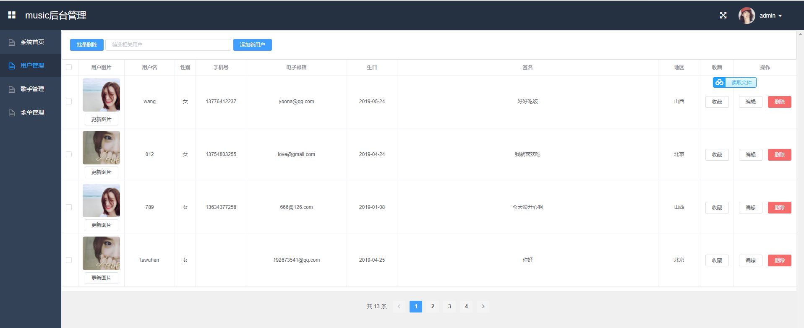

## 音乐网站播放器

#### 介绍
音乐网站播放器+音乐网站管理系统+音乐网站后台

#### 软件架构
使用vue+springboot+mybatis-plus+mysql技术的前后端分离项目

#### 前端 安装教程
- 需要有node.js环境，不建议使用最新版，可能有bug
- node官网下载位置：https://nodejs.org/download/release/v12.14.1/
- 我这边用的12.14.1 选择msi文件根据自己电脑版本下载安装包，
- 安装后打开cmd页面  输入node-v  \ npm -v 返回版本号表示安装成功
- 运行需要在项目根目录下，例如：

* 1.  npm install（安装运行环境） 
* 2.  npm run dev（运行）

#### 后端 安装教程
* 1.配置maven仓库，刷新maven
* 2.创建music数据库，执行数据库脚本
* 3.修改application.properties配置文件
* 4.静态资源和src文件夹同级，文件名参考config文件夹下的FileConfig配置
* 5.主类启动

#### 图片及歌曲资源
链接：https://pan.baidu.com/s/1ou7U4PJi7VDeEyhTImaIKg 
提取码：9w2i

#### 示例图片
##### 前台

##### 前台管理端

#### 需要注意
* 运行前台时提示 ”'webpack-dev-server' 不是内部或外部命令，也不是可运行的程序或批处理文件“ 
* 解决方案： npm install webpack-dev-server --save-dev
* 一般是node环境问题，当启动报如下错误时
  
*解决方案，如图，我的music-client下根本没有static文件夹，只有dist下有，全局搜索copyWebpackPlugin、将关于static的地址全部改为../dist/static，异常解决

#### 参与贡献

1.  Fork 本仓库
2.  新建 Feat_xxx 分支
3.  提交代码
4.  新建 Pull Request

#### 特技

1.  使用 Readme\_XXX.md 来支持不同的语言，例如 Readme\_en.md, Readme\_zh.md
2.  Gitee 官方博客 [blog.gitee.com](https://blog.gitee.com)
3.  你可以 [https://gitee.com/explore](https://gitee.com/explore) 这个地址来了解 Gitee 上的优秀开源项目
4.  [GVP](https://gitee.com/gvp) 全称是 Gitee 最有价值开源项目，是综合评定出的优秀开源项目
5.  Gitee 官方提供的使用手册 [https://gitee.com/help](https://gitee.com/help)
6.  Gitee 封面人物是一档用来展示 Gitee 会员风采的栏目 [https://gitee.com/gitee-stars/](https://gitee.com/gitee-stars/)
